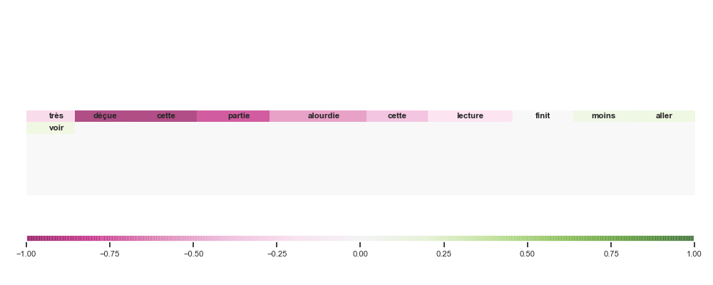
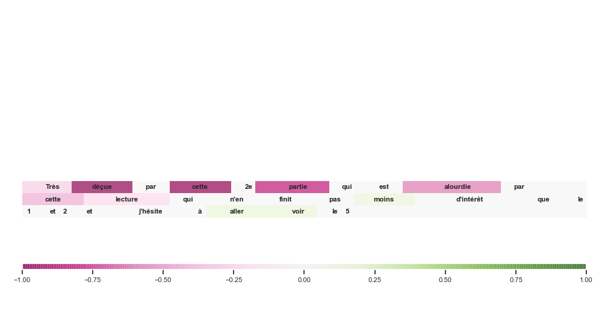

<h1 align="center">Transparency and interpretability of Deep Learning Algorithms for Textual Data</h1>

<h2 align="center">:speech_balloon: GradCAM for Textual Data :speech_balloon: </h2>


## Kedro Framework

**To install dependence** :

1. Create a new environment : `conda create --name <env_name> python=3.8` 
2. Install `Kedro 0.16.6` : `conda install -c conda-forge kedro=0.16.6` or `pip install kedro==0.16.6`
3. Launch `kedro install` to install  project dependencies

If you are using CUDA : `pip install torch===1.7.1+cu110 torchvision===0.8.2+cu110 torchaudio===0.7.2 -f https://download.pytorch.org/whl/torch_stable.html
`

Otherwise : `pip install torch`

## GradCAM with pytorch

### Implement the object to the initial models
How to integrate our GradCAM method with pytorch models ?

Here is a example of how to make change to make GradCAM available for a Bilstm with CNN.
#### Before :

```python
class BilstmCnn(nn.Module):
    def __init__(self,  embedding_matrix, sentence_size, input_dim, hidden_dim, layer_dim, output_dim, feature_size
                 , kernel_size, dropout_rate, padded):
        super(BilstmCnn, self).__init__()

        self.mp_kernel_size = 2
        self.linear_dim = int(2*hidden_dim * (sentence_size-kernel_size)/2)
        self.embedding = nn.Embedding.from_pretrained(nn.Parameter(torch.tensor(embedding_matrix, dtype=torch.float32)), padding_idx=0)
        self.LSTM = nn.LSTM(input_size=input_dim, hidden_size=hidden_dim, bidirectional=True,
                            num_layers=layer_dim, dropout=dropout_rate, bias=True)
        self.convLayer = nn.Sequential(
            nn.Conv1d(in_channels=2*hidden_dim, out_channels=feature_size, kernel_size=kernel_size, bias=True),
            nn.BatchNorm1d(2*hidden_dim),
            nn.ReLU())
        self.maxpool = nn.MaxPool1d(kernel_size=self.mp_kernel_size)
        self.fc = nn.Linear(self.linear_dim, output_dim)

    def forward(self, x):
        out = self.embedding(x)
        out = out.permute(1,0,2)
        out, (hn, cn) = self.LSTM(out)
        out = out.permute(1,2,0)
        out = self.convLayer(out)
        out = self.maxpool(out)
        out = out.reshape(out.size(0), -1)
        out = self.fc(out)

        return out
```

#### After :
```python
from deep_nlp.grad_cam.model import GradCamBaseModel


class BilstmCnn(GradCamBaseModel):
    def __init__(self,  embedding_matrix, sentence_size, input_dim, hidden_dim, layer_dim, output_dim, feature_size
                 , kernel_size, dropout_rate, padded):
        super(BilstmCnn, self).__init__()

        self.padded = padded
        self.kernel_size= kernel_size
        self.mp_kernel_size = 2

        if not self.padded:
            self.linear_dim = int(2*hidden_dim * (sentence_size-kernel_size)/2)
        else:
            self.linear_dim = int(2 * hidden_dim * (sentence_size - 1)/ 2)

        self.embedding = nn.Embedding.from_pretrained(nn.Parameter(torch.tensor(embedding_matrix, dtype=torch.float32))
                                                      , padding_idx=0)
        self.LSTM = nn.LSTM(input_size=input_dim, hidden_size=hidden_dim, bidirectional=True,
                            num_layers=layer_dim, dropout=dropout_rate, bias=True)
        self.convLayer = nn.Sequential(
            nn.Conv1d(in_channels=2*hidden_dim, out_channels=feature_size, kernel_size=kernel_size, bias=True),
            nn.BatchNorm1d(2*hidden_dim),
            nn.ReLU())
        self.maxpool = nn.MaxPool1d(kernel_size=self.mp_kernel_size)
        self.fc = nn.Linear(self.linear_dim, output_dim)
        self.softmax = nn.Softmax(dim=1)
        # Fill up pipelines
        self.before_conv.add_module("conv", self.convLayer)
        self.pool.add_module("maxpool", self.maxpool)
        self.after_conv.add_module("fc", self.fc)
        self.after_conv.add_module("sm", self.softmax)

    def get_activations(self, x):
        # Documentation said to !!!
        # Each forward step, reset gradient list to only get the one from the actual run (=from this forward step)
        self.reset_gradient_list()
        if self.padded:
            x= nn.ZeroPad2d((0, self.kernel_size - 1, 0, 0))(x)
        x = self.embedding(x)
        x= x.permute(1, 0, 2)
        x, (_, _) = self.LSTM(x)
        x = x.permute(1, 2, 0)
        x= self.before_conv(x)
        return x

    def forward(self, x):
        x= self.get_activations(x)
        if x.requires_grad:
            h= self.register_hook(x)
        x= self.pool(x)
        x = x.reshape(x.size(0), -1)
        x= self.after_conv(x)

        return x
```

### Get interpretability

With `class BilstmCnn(GradCamBaseModel)`, there is a bunch of new methods to work with the GradCAM heatmap like :

```python
bilstmcnn_gradcam_model= BilstmCnn(**params) # CPU model only

heatmap_= bilstmcnn_gradcam_model.get_heatmap(text= text_sentence # `text_sentence` is the input of the model
                                    , num_class= 1 # Compute heatmap for class 1 (i.e. positive comment)
                                    , dim= [0, 2]
                                    , type_map= type_map)
# Token heatmap
plot_text_and_heatmap(text= word.tolist()
                  , heatmap= heatmap_
                  , figsize= (10, 4)
                  , fontsize_text= "small"
                  , cmap= "PiYG"
                  , word_or_letter= "word")
```
Output for class 1 :



With a readjustment of the input with the initial comment:

